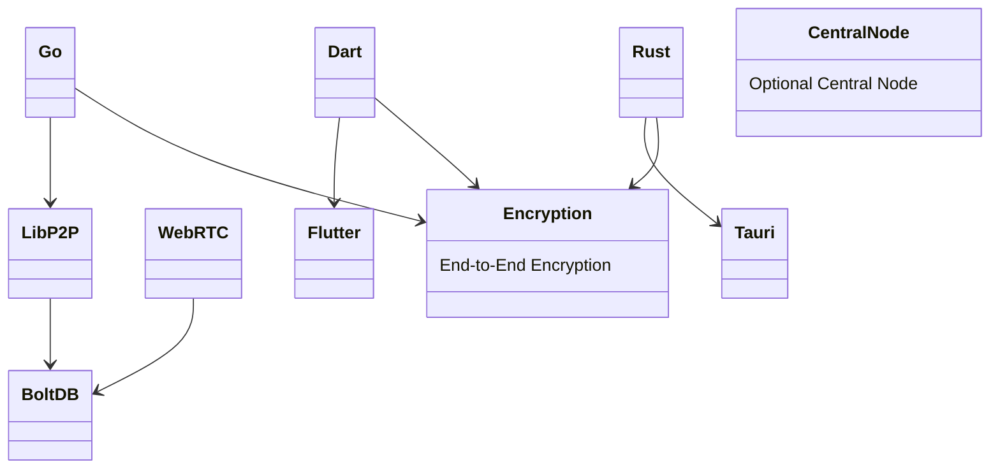
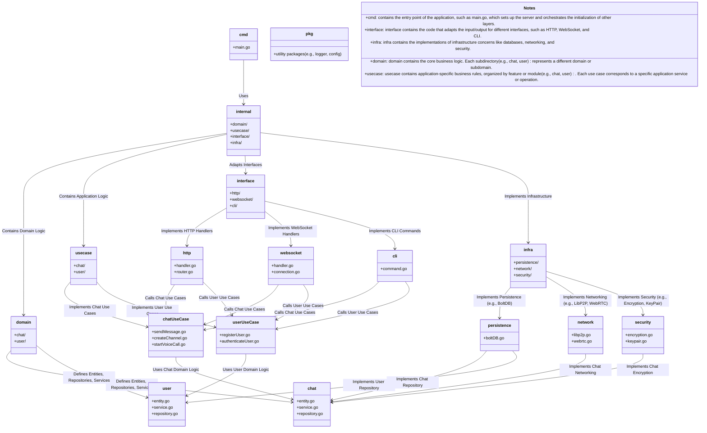
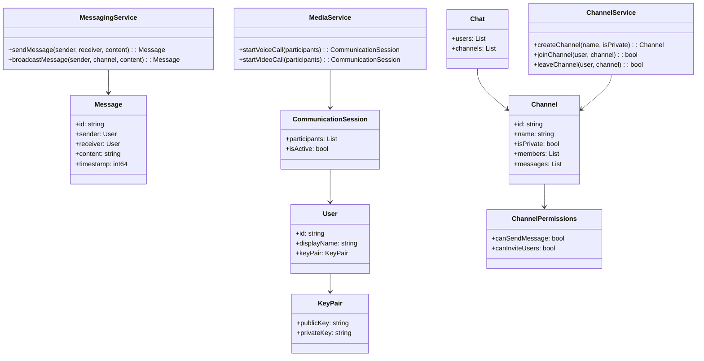
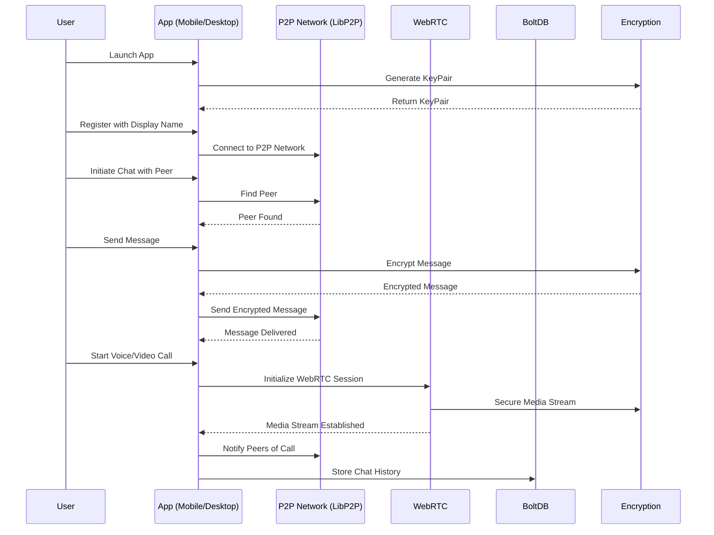

# Decentralized Chat Application

## Disclaimer
This project is a work in progress and is not yet functional. The goal is to build a decentralized chat application using Go and Libp2p, with a strong focus on privacy, security, and scalability. The project is designed with Clean Architecture and Domain-Driven Design (DDD) principles to ensure modularity and testability.

## Table of Contents
- [Introduction](#introduction)
- [Features](#features)
- [Technology Stack](#technology-stack)
- [Clean Architecture](#clean-architecture)
- [Domain-Driven Design (DDD)](#domain-driven-design-ddd)
- [Flow Diagram](#flow-diagram)
- [Getting Started](#getting-started)
    - [Prerequisites](#prerequisites)
    - [Installation](#installation)
    - [Running the Application](#running-the-application)
- [Contributing](#contributing)
- [License](#license)

## Introduction

This project is a fully decentralized chat application built using Go and Libp2p. Each instance of the application acts as a node in the network, allowing for peer-to-peer communication without a central server. The application is designed with a strong focus on privacy, security, and scalability, utilizing modern software architecture principles.

## Features

- **Decentralized**: No central server; each user is a node in the network.
- **Peer-to-Peer Communication**: Leverages libp2p for direct communication between nodes.
- **Encrypted Messaging**: Ensures privacy through end-to-end encryption.
- **DHT for Peer Discovery**: Utilizes a Distributed Hash Table (DHT) for finding peers.
- **Cross-Platform**: Compatible with desktop and mobile environments.
- **Extensible Architecture**: Built using Clean Architecture and Domain-Driven Design (DDD) principles.

## Technology Stack

You can find more about the tech stack in my mermaid diagram.



## Clean Architecture

The project follows the principles of Clean Architecture, ensuring that the business logic is separated from the implementation details, making the codebase more modular and testable.



## Domain-Driven Design (DDD)

The application is structured around DDD, focusing on core business concepts and ensuring that the domain logic is at the heart of the application.



## Flow Diagram
This diagram outlines the flow of data and operations within the application, from user input to peer communication.



## Getting Started

### Prerequisites
- Go: Install Go (version 1.22.5 or higher recommended)
- Git: Install Git
- Optional (for now): Docker for containerized deployment

## Installation
1. Clone the Repository:
```bash
git clone https://github.com/rafagomes/decentralized-chat-backend.git
```
2. Install Dependencies:
```bash
go mod tidy
```

## Running the Application
To start the application, you can run the following command:

```bash
go run cmd/p2pchat/main.go -port 8080
```

To start multiple nodes, simply open new terminals and specify different ports:
```bash
go run cmd/p2pchat/main.go -port 8081
```

## Contributing
Contributions are welcome! Please open an issue or submit a pull request for any improvements or bug fixes.

### Steps to Contribute
- Steps to Contribute:
- Fork the repository.
- Create a new branch: git checkout -b feature/my-new-feature.
- Commit your changes: git commit -am 'Add some feature'.
- Push to the branch: git push origin feature/my-new-feature.
- Submit a pull request.

## License
This project is licensed under the MIT License - see the LICENSE file for details.

### Summary:
- **Introduction**: Provides an overview of the project.
- **Features**: Lists the key features of the application.
- **Technology Stack, Clean Architecture, DDD, and Flow Diagrams**: Visually explains the project structure and concepts using Mermaid diagrams.
- **Getting Started**: Simple instructions to install and run the application.
- **Contributing**: Encourages contributions with clear steps.
- **License**: Clarifies the licensing under MIT.